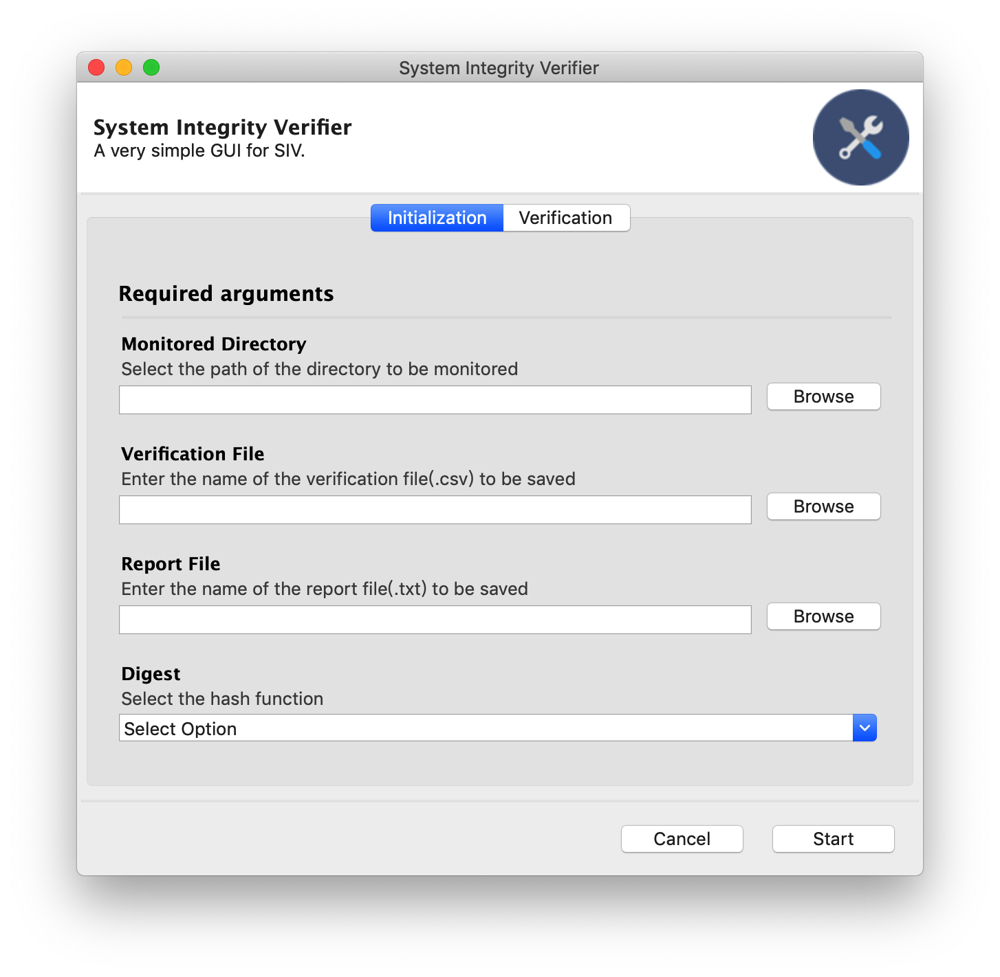
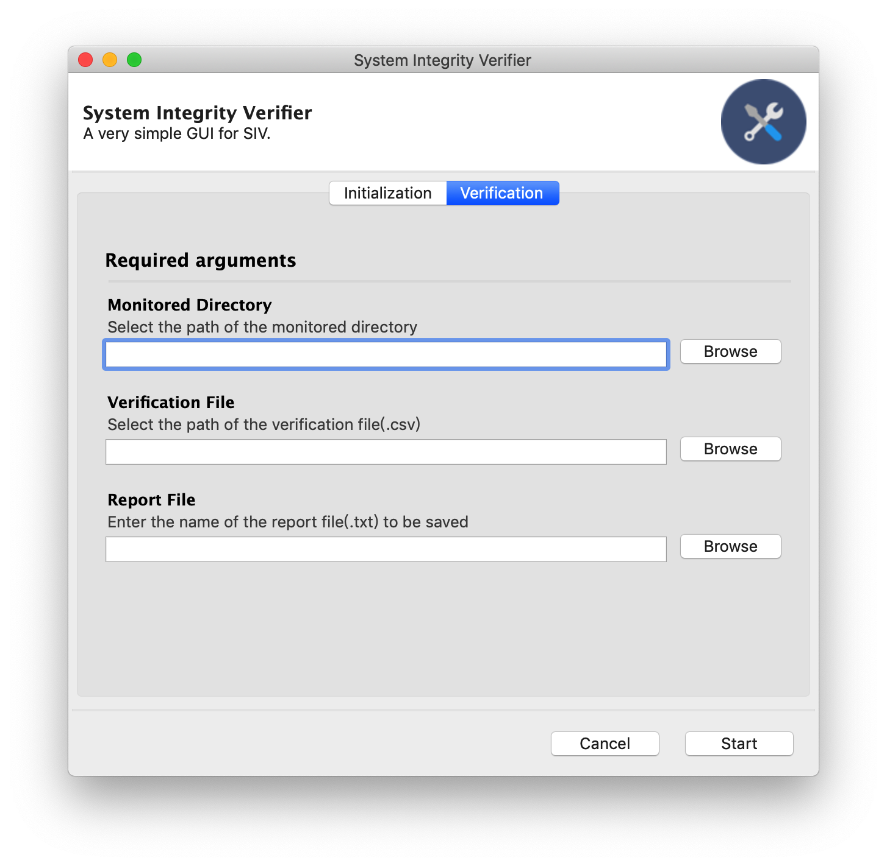

# System Integrity Verifier(SIV)

A very simple system integrity verifier (SIV). The goal is to detect file system modifications occurring within a directory tree. The SIV outputs statistics and warnings about changes to a report file specified by the user.

The SIV can be run either in initialization mode or in verification mode.

# Environment

* MacOS / Ubuntu 18.04
* Python 3.7
* Gooey
* PyInstaller

# Usage

``` shell
# Example 1: Initialization mode
python3 siv.py -i -D important_directory -V verificationDB.csv -R report.txt -H <digest>
```

``` shell
# Example 2: Verification mode
python3 siv.py -v -D important_directory -V verificationDB.csv -R report.txt
```

# GUI

<p align="center">
    
    
</p>

# Detectable Changes

* New or removed files/directories
* Files with a different size than recorded
* Files with a different message digest than computed before
* Files/directories with a different user/group
* Files/directories with modified access right
* Files/directories with a different modification date

# LICENSE

GNU General Public License v3.0

